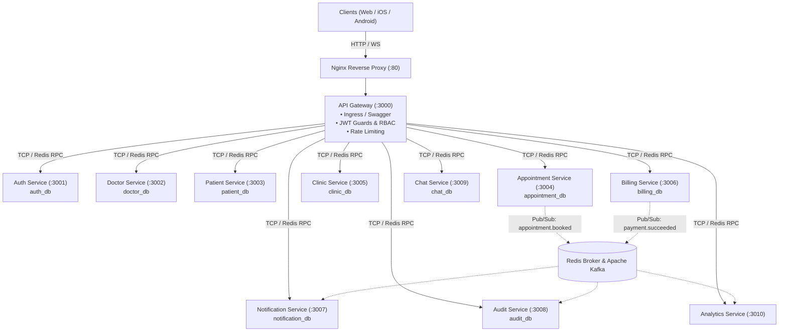

# MedCare Backend — Enterprise Microservices Architecture & System Blueprint

## Executive Architecture Summary
MedCare is a distributed, high-throughput healthcare platform built on NestJS 11, TypeScript, PostgreSQL (Multi-Database per Service), Redis, Prisma 7, and Docker.

---

## 1. System Topology & Communication



---

## 2. Microservice Inventory & Port Allocation

| Component | Port | Database | Responsibilities |
| :--- | :--- | :--- | :--- |
| **API Gateway** | `HTTP :3000` | — | Ingress routing, Swagger documentation, JWT authentication, rate limiting |
| **Auth Service** | `TCP :3001` | `auth_db` | Authentication, password encryption, OAuth2 SSO, refresh tokens |
| **Doctor Service** | `TCP :3002` | `doctor_db` | Doctor profiles, weekly schedules, consultation notes, payouts |
| **Patient Service** | `TCP :3003` | `patient_db` | Medical records, vital signs, digital prescriptions |
| **Appointment Service** | `TCP :3004` | `appointment_db` | Bookings, live queue tokens, 6-step check-in wizard |
| **Clinic Service** | `TCP :3005` | `clinic_db` | Multi-branch clinics, consultation rooms, staff rosters |
| **Billing Service** | `TCP :3006` | `billing_db` | Invoices, payments, gateway webhooks, refunds |
| **Notification Service** | `TCP :3007` | `notification_db` | Multi-channel broadcasts, email templates, SMS queue |
| **Audit Service** | `TCP :3008` | `audit_db` | HIPAA-compliant immutable audit trail, security logs |
| **Chat Service** | `TCP :3009` | `chat_db` | Real-time teleconsultation messaging, attachments |
| **Analytics Service** | `TCP :3010` | In-Memory / Broker | Real-time clinic load KPIs, revenue forecasts |

---

## 3. Database Isolation Matrix

```
PostgreSQL Cluster (:5435)
  ├── 📂 auth_db         (AuthService)
  ├── 📂 doctor_db       (DoctorService)
  ├── 📂 patient_db      (PatientService)
  ├── 📂 appointment_db  (AppointmentService)
  ├── 📂 clinic_db       (ClinicService)
  ├── 📂 billing_db      (BillingService)
  ├── 📂 notification_db (NotificationService)
  ├── 📂 audit_db        (AuditService)
  └── 📂 chat_db         (ChatService)
```

---

## 4. Key Developer Commands

```bash
# 1. Start Docker Infrastructure (PostgreSQL, Redis, pgAdmin, Mailpit)
npm run docker:dev

# 2. Generate Prisma Clients for All 9 Services
npm run prisma:generate:all

# 3. Push Schemas to Isolated Databases
npm run prisma:push:all

# 4. Start API Gateway (Local Node)
npm run start:gateway:dev

# 5. Start Individual Microservices
npm run start:auth:dev
npm run start:doctor:dev
npm run start:appointment:dev

# 6. Run Unit Tests & Linting
npm run test
npm run lint

# 7. Production Multi-Container Docker Stack
docker compose up -d --build
```
