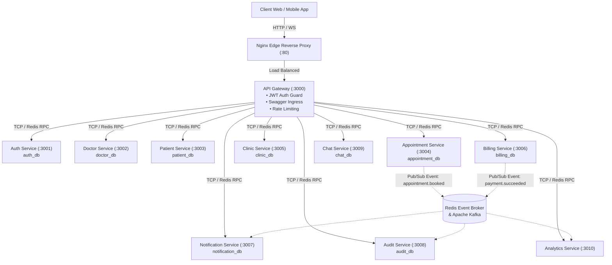

<div align="center">

# 🏥 MedCare — Enterprise Distributed Healthcare & Telemedicine Platform

[](.github/workflows/ci.yml)
[](https://nestjs.com/)
[](https://www.typescriptlang.org/)
[](https://www.postgresql.org/)
[](https://www.prisma.io/)
[](https://redis.io/)
[](https://www.docker.com/)
[](https://nginx.org/)

<p align="center">
  A high-throughput, fault-tolerant, <b>Database-per-Service Microservices Platform</b> designed for hospitals, polyclinics, telemedicine providers, and multi-tenant healthcare networks.
</p>

</div>

---

## 📑 Table of Contents
1. [Architecture Overview](#-architecture-overview)
2. [Microservices & Port Matrix](#-microservices--port-matrix)
3. [Database-per-Service Model](#-database-per-service-model)
4. [Inter-Service Communication & Event Matrix](#-inter-service-communication--event-matrix)
5. [Core Business Domains](#-core-business-domains)
6. [Tech Stack](#-tech-stack)
7. [Getting Started & Local Development](#-getting-started--local-development)
8. [Database Migrations & Prisma 7](#-database-migrations--prisma-7)
9. [Docker Deployment](#-docker-deployment)
10. [Role-Based Access Control (RBAC)](#-role-based-access-control-rbac)
11. [Testing & Quality Assurance](#-testing--quality-assurance)

---

## 🏛 Architecture Overview

MedCare is engineered with a **pure decoupled microservices architecture**. The API Gateway handles authentication, rate-limiting, SSL termination, and request routing without maintaining any database state. Internal domain logic is distributed across 10 isolated services that communicate using hybrid RPC commands and asynchronous event streaming.



---

## 🔌 Microservices & Port Matrix

| Service | Protocol / Port | Database | Primary Responsibility |
| :--- | :--- | :--- | :--- |
| **API Gateway** | `HTTP :3000` | — | Ingress routing, OpenAPI / Swagger 3.0 docs, JWT guards, Throttler |
| **Auth Service** | `TCP :3001` | `auth_db` | User identity, password encryption, OAuth2 SSO, refresh tokens |
| **Doctor Service** | `TCP :3002` | `doctor_db` | Doctor profiles, weekly availability slots, consultation notes, payouts |
| **Patient Service** | `TCP :3003` | `patient_db` | Medical history vault, vital signs tracking, digital prescriptions |
| **Appointment Service**| `TCP :3004` | `appointment_db` | Booking wizard, live token queue, receptionist 6-step check-in |
| **Clinic Service** | `TCP :3005` | `clinic_db` | Multi-branch clinics, consultation rooms, staff rosters |
| **Billing Service** | `TCP :3006` | `billing_db` | Invoices, payment gateways (Stripe/SSLCommerz), financial refunds |
| **Notification Service**| `TCP :3007` | `notification_db`| Multi-channel broadcasts, email dispatch, SMS alerts |
| **Audit Service** | `TCP :3008` | `audit_db` | HIPAA-compliant immutable audit trail, security access logs |
| **Chat Service** | `TCP :3009` | `chat_db` | Teleconsultation direct messaging, media attachments, read receipts |
| **Analytics Service** | `TCP :3010` | In-Memory / Broker| Real-time clinic load KPIs, revenue forecasting, waiting time stats |

---

## 🗄 Database-per-Service Model

To eliminate tight schema coupling and prevent monolithic database bottlenecks, each microservice owns an isolated PostgreSQL database instance:

```
PostgreSQL Cluster (:5435)
  ├── 📂 auth_db         -> Users, OAuth Providers, Roles & Permissions
  ├── 📂 doctor_db       -> Doctor Profiles, Schedules, Consultation Notes
  ├── 📂 patient_db      -> Patient Profiles, Medical Records, Prescriptions
  ├── 📂 appointment_db  -> Bookings, Token Queues, Check-in Records
  ├── 📂 clinic_db       -> Clinics, Departments, Rooms, Staff Rotations
  ├── 📂 billing_db      -> Invoices, Line Items, Transactions, Refunds
  ├── 📂 notification_db -> Notification Templates, Delivery Logs
  ├── 📂 audit_db        -> Immutable Audit Trail Logs
  └── 📂 chat_db         -> Conversations, Messages, Attachments
```

Cross-service data consistency is maintained via **Logical IDs** and **Eventual Consistency** over the event stream.

---

## 📡 Inter-Service Communication & Event Matrix

### 1. Synchronous Command Dispatch (RPC)
The API Gateway forwards client requests to internal microservices via NestJS `ClientProxy.send()` pattern without direct database access.

### 2. Asynchronous Event Streams (`@EventPattern`)

| Event Pattern | Producer | Consumers | Purpose |
| :--- | :--- | :--- | :--- |
| `appointment.booked` | `appointment-service` | `notification-service`, `billing-service`, `analytics-service` | Sends confirmation SMS, generates invoice, updates analytics |
| `appointment.completed` | `appointment-service` | `doctor-service`, `billing-service`, `audit-service` | Calculates doctor commission, marks invoice paid, creates audit entry |
| `payment.succeeded` | `billing-service` | `appointment-service`, `notification-service` | Confirms appointment booking, emails receipt to patient |
| `prescription.issued` | `doctor-service` | `patient-service`, `notification-service` | Syncs to patient medical history, sends pharmacy pickup notification |
| `security.audit_log` | All Services | `audit-service` | Dispatches compliance access log asynchronously |

---

## 🌟 Core Business Domains

### 1. Receptionist 6-Step Patient Check-In Wizard
- **Step 1: Patient Verification** — Instant search by national ID, phone, or QR code.
- **Step 2: Vitals Recording** — Blood pressure, pulse, SpO2, BMI calculation.
- **Step 3: Doctor & Slot Assignment** — Real-time verification of available consultation rooms.
- **Step 4: Token Generation** — Live queue token allocation (`A-101`, `B-204`).
- **Step 5: Billing & Copay Verification** — Automatic copay calculation and invoice generation.
- **Step 6: Real-time Live Board Sync** — Broadcasts updated token queue to waiting room monitors via Server-Sent Events (SSE).

### 2. Telehealth & Consultation
- WebRTC video consultation token generation.
- Real-time end-to-end WebSocket chat with document attachments.
- Secure, digital prescriptions signed with clinician credentials.

---

## 🛠 Tech Stack

- **Framework**: [NestJS 11](https://nestjs.com/) (Modular Monorepo Architecture)
- **Language**: [TypeScript 5](https://www.typescriptlang.org/)
- **Database Engine**: [PostgreSQL 16](https://www.postgresql.org/) (Multi-Database Provisioning)
- **ORM & Driver**: [Prisma 7.9](https://www.prisma.io/) with `@prisma/adapter-pg`
- **Broker & Cache**: [Redis 7](https://redis.io/) (Pub/Sub & TCP ClientProxy) / [Apache Kafka](https://kafka.apache.org/)
- **Ingress Proxy**: [Nginx](https://nginx.org/) (Reverse proxy, gzip compression, WebSocket support, SSE non-buffering)
- **Containerization**: [Docker & Docker Compose](https://www.docker.com/) (Multi-Stage Builds on `node:22-alpine`)
- **Documentation**: [Swagger / OpenAPI 3.0](https://swagger.io/)
- **Testing**: [Jest](https://jestjs.io/) & Supertest

---

## 🚀 Getting Started & Local Development

### Prerequisites
- **Node.js**: `v22.x` or higher
- **Docker & Docker Desktop**: Installed and running
- **Git**: Installed

### Step 1: Clone & Install Dependencies
```bash
git clone https://github.com/mdrezuanislamridoy/MedCare-Backend.git
cd MedCare-Backend
npm install
```

### Step 2: Configure Environment Variables
Copy `.env.example` to `.env`:
```bash
cp .env.example .env
```

### Step 3: Start Infrastructure (PostgreSQL & Redis)
Start PostgreSQL (port `5435`), Redis (port `6380`), pgAdmin (`:5050`), and Mailpit (`:8025`):
```bash
npm run docker:dev
```

### Step 4: Generate Prisma Clients & Sync Schemas
```bash
# Generate Prisma 7 clients for all 9 services
npm run prisma:generate:all

# Sync all schemas to their respective databases (auth_db, doctor_db, etc.)
npm run prisma:push:all
```

### Step 5: Start the Microservices

#### Option A: Running Specific Services Locally
```bash
# Start API Gateway (Port 3000)
npm run start:gateway:dev

# Start Auth Microservice (Port 3001)
npm run start:auth:dev

# Start Doctor Microservice (Port 3002)
npm run start:doctor:dev
```

#### Option B: Hybrid Dev Runner (All Modules in Single Process)
```bash
npm run start:dev
```

#### Access Swagger Documentation:
Open your browser and navigate to: **[http://localhost:3000/docs](http://localhost:3000/docs)**

---

## 📦 Database Migrations & Prisma 7

### Batch Operations
```bash
# Generate clients for all microservices
npm run prisma:generate:all

# Push schemas across all 9 databases
npm run prisma:push:all
```

### Individual Service Migrations
```bash
npm run prisma:migrate:auth
npm run prisma:migrate:doctor
npm run prisma:migrate:patient
npm run prisma:migrate:appointment
npm run prisma:migrate:clinic
npm run prisma:migrate:billing
npm run prisma:migrate:notification
npm run prisma:migrate:audit
npm run prisma:migrate:chat
```

---

## 🐳 Docker Deployment

### Run All Microservices in Containers (Production Stack)
```bash
docker compose up -d --build
```

### Check Container Status
```bash
docker compose ps
```

### Stop All Containers
```bash
docker compose down
```

---

## 🔐 Role-Based Access Control (RBAC)

MedCare supports 7 enterprise roles enforced by JWT guards and the `@Roles()` decorator:

| Role | Access Level | Description |
| :--- | :--- | :--- |
| `PATIENT` | Self Domain | Book appointments, view prescriptions, chat with doctors |
| `DOCTOR` | Clinical Domain | Manage schedules, write consultation notes, issue prescriptions |
| `RECEPTIONIST` | Queue Domain | 6-step check-in wizard, token allocation, patient registration |
| `CLINIC_MANAGER`| Branch Domain | Roster staff, manage rooms, monitor branch metrics |
| `BILLING_STAFF` | Financial Domain | Manage invoices, process payments, initiate refunds |
| `SUPPORT_STAFF` | Helpdesk Domain | Customer support tickets, issue resolution |
| `SUPER_ADMIN` | Global Domain | System configuration, audit logs, global analytics |

---

## 🧪 Testing & Quality Assurance

```bash
# Run unit tests
npm run test

# Run test coverage report
npm run test:cov

# Run code linter
npm run lint
```

---

## 📄 License
This project is proprietary and confidential. Unauthorized copying, transfer, or distribution of this software is strictly prohibited.
